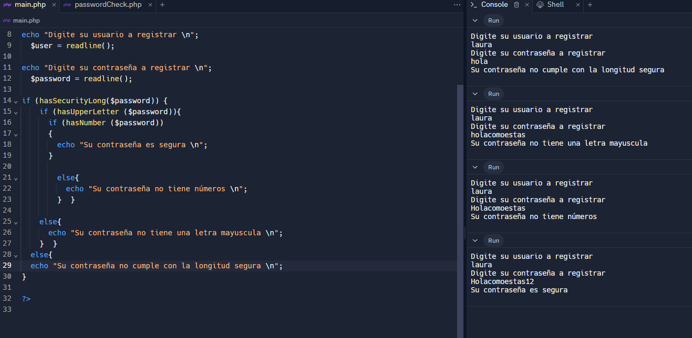

<h1>Taller -10 - Laura Andrea Rojas Crucerira</h1>

<h2>Información</h2>

Curso: Full Stack Básico - Grupo 1

Profesor: Cristian Patiño

<h2>Punto 1: Constantes y variables</h2>

<h2>Punto 2: Sumas de constantes y variables</h2>

<h2>Punto 3: Suma de dos números indicados por el usuario</h2>

<h2>Punto 4: Datos del usuario en consola</h2>

<h2>Punto 5: Entrada de bolera usando if/else</h2>

<h2>Punto 6: Detección de mayoría de edad</h2>

<h2>Punto 7: Selección de operación aritmética</h2>

<h2>Punto 8: Entrada a la bolera usando switch</h2>

<h2>Punto 9: Tabla de multiplicar usando while</h2>

<h2>Punto 10: Números pares usando while</h2>

<h2>Punto 11: Números impares usando for</h2>

<h2>Punto 12: Tabla de multiplicar usando for</h2>

<h2>Punto 13: Suma de valores de un arreglo usando for each</h2>

<h2>Punto 14: Revisión de contraseña</h2>

<h2>Punto 15: Selección de operación aritmética usando funciones</h2>
